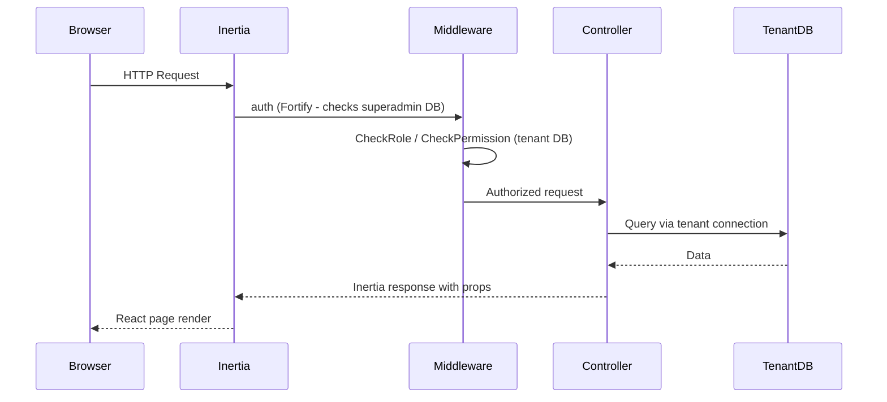
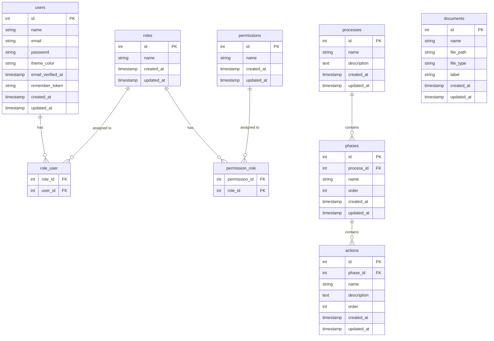

# Design Document: Port Sample to Reccheck

## Overview

This design covers the full port of the `re-check-p2` sample application into the `reccheck` project. The `reccheck` project is a Laravel 13 + Inertia v3 + React 19 + TypeScript + Tailwind v4 application. The port introduces:

- Tenant database migrations and models (RBAC, Process hierarchy, Documents)
- Custom RBAC middleware (no Spatie)
- Process Management (3-level: Process → Phase → Action, with reordering)
- Document Management (local filesystem storage, no Supabase)
- Admin Panel (User CRUD + Role CRUD, permission-gated)
- Profile Management (theme color, password change, account deletion)
- Full React frontend (pages, layouts, components) using JSX files

All tenant data lives in the `tenant` SQLite connection. The superadmin authentication flow (Fortify, 2FA) already exists and is not changed.

---

## Architecture

### Two-Database Model

```
Superadmin DB (database/superadmin.sqlite)
  - users (superadmin logins only)
  - sessions, cache, jobs
  - [future: tenant connection configs]

Tenant DB (database/tenant.sqlite in dev)
  - users (tenant users with theme_color)
  - roles, permissions, role_user, permission_role
  - processes, phases, actions
  - documents
```

### Request Flow



### Directory Structure Changes

```
app/
  Http/
    Controllers/
      ProcessManagementController.php
      DocumentManagementController.php
      Admin/
        UserManagementController.php
        RoleManagementController.php
    Middleware/
      CheckRole.php
      CheckPermission.php
  Models/
    Role.php
    Permission.php
    Process.php
    Phase.php
    Action.php
    Document.php
    TenantUser.php  (tenant-side user model)

database/migrations/tenant/
  xxxx_create_tenant_users_table.php
  xxxx_create_roles_table.php
  xxxx_create_permissions_table.php
  xxxx_create_role_user_table.php
  xxxx_create_permission_role_table.php
  xxxx_create_processes_table.php
  xxxx_create_phases_table.php
  xxxx_create_actions_table.php
  xxxx_create_documents_table.php

resources/js/
  constants/
    workflowConstants.js
  components/
    ui/                        (existing shadcn components)
    PhaseComponent.jsx
    ActionComponent.jsx
    ProcessModal.jsx
    PhaseModal.jsx
    ActionModal.jsx
    DocumentUploadModal.jsx
    UserModal.jsx
    RoleModal.jsx
  layouts/
    AuthenticatedLayout.jsx
    GuestLayout.jsx
  pages/
    Dashboard.jsx  (update existing dashboard.tsx)
    ProcessManagement.jsx
    DocumentManagement.jsx
    Admin/
      Users.jsx
      Roles.jsx
    Profile/
      Edit.jsx
    auth/                      (existing, keep as-is)
```

---

## Components and Interfaces

### PHP Controllers

#### ProcessManagementController

| Method | Route | Description |
|--------|-------|-------------|
| `index()` | GET /processes | Returns all processes with nested phases and actions |
| `storeProcess()` | POST /processes | Creates a new process |
| `updateProcess()` | PUT /processes/{process} | Updates a process |
| `destroyProcess()` | DELETE /processes/{process} | Deletes process + cascades |
| `storePhase()` | POST /processes/{process}/phases | Creates a phase |
| `updatePhase()` | PUT /phases/{phase} | Updates a phase |
| `destroyPhase()` | DELETE /phases/{phase} | Deletes phase + cascades |
| `reorderPhases()` | POST /processes/{process}/phases/reorder | Updates phase order |
| `storeAction()` | POST /phases/{phase}/actions | Creates an action |
| `updateAction()` | PUT /actions/{action} | Updates an action |
| `destroyAction()` | DELETE /actions/{action} | Deletes an action |
| `reorderActions()` | POST /phases/{phase}/actions/reorder | Updates action order |

#### DocumentManagementController

| Method | Route | Description |
|--------|-------|-------------|
| `index()` | GET /documents | Returns all document records |
| `store()` | POST /documents | Stores file + creates record |
| `download()` | GET /documents/{document}/download | Serves file download |
| `destroy()` | DELETE /documents/{document} | Deletes file + record |

#### Admin\UserManagementController

| Method | Route | Description |
|--------|-------|-------------|
| `index()` | GET /admin/users | Returns all tenant users with roles |
| `store()` | POST /admin/users | Creates a tenant user |
| `update()` | PUT /admin/users/{user} | Updates user + syncs roles |
| `destroy()` | DELETE /admin/users/{user} | Deletes user + role pivot |

#### Admin\RoleManagementController

| Method | Route | Description |
|--------|-------|-------------|
| `index()` | GET /admin/roles | Returns all roles with permissions |
| `store()` | POST /admin/roles | Creates a role + attaches permissions |
| `update()` | PUT /admin/roles/{role} | Updates role + syncs permissions |
| `destroy()` | DELETE /admin/roles/{role} | Deletes role + all pivots |

### Middleware

#### CheckRole

```php
// Accepts one or more role names as middleware parameters
// e.g. ->middleware('role:admin,superuser')
handle(Request $request, Closure $next, string ...$roles): Response
```

Checks if `Auth::user()` has at least one matching role via the `role_user` pivot on the tenant DB. Aborts 403 if not.

#### CheckPermission

```php
// Accepts one or more permission names
// e.g. ->middleware('permission:admin')
handle(Request $request, Closure $next, string ...$permissions): Response
```

Checks if the authenticated user has at least one matching permission through their roles via `permission_role` pivot. Aborts 403 if not.

### Inertia Shared Data

`HandleInertiaRequests::share()` adds:

```php
[
  'auth' => [
    'user' => $request->user(),
    'roles' => $roles,           // array of role name strings
    'permissions' => $permissions, // array of permission name strings
  ]
]
```

This allows the React frontend to conditionally render admin navigation and gate UI controls.

### Frontend Constants

`resources/js/constants/workflowConstants.js`:

```js
export const AVAILABLE_ROLES = [
  'admin',
  'manager',
  'editor',
  'viewer',
];

export const THEME_COLORS = [
  'zinc', 'slate', 'stone', 'gray', 'neutral',
  'red', 'rose', 'orange', 'amber', 'yellow',
  'lime', 'green', 'teal',
];

export const DOCUMENT_LABELS = ['form', 'doc'];
```

---

## Data Models

### Tenant DB Schema



### Model Connections Summary

| Model | `$connection` | Notes |
|-------|--------------|-------|
| `User` (existing superadmin) | default | Not changed |
| `TenantUser` | `tenant` | Separate model for tenant users |
| `Role` | `tenant` | |
| `Permission` | `tenant` | |
| `Process` | `tenant` | |
| `Phase` | `tenant` | |
| `Action` | `tenant` | |
| `Document` | `tenant` | |

### File Storage

Documents are stored at `storage/app/documents/{filename}` on the local filesystem. The `file_path` column in the `documents` table stores the relative path used by `Storage::disk('local')->path($file_path)` for downloads and deletions.

---

## Correctness Properties

*A property is a characteristic or behavior that should hold true across all valid executions of a system — essentially, a formal statement about what the system should do. Properties serve as the bridge between human-readable specifications and machine-verifiable correctness guarantees.*

### Property 1: RBAC Access Control Correctness

*For any* tenant user with an arbitrary set of roles and permissions, the CheckRole middleware SHALL grant access if and only if the user has at least one of the required roles; the CheckPermission middleware SHALL grant access if and only if the user has at least one of the required permissions through their assigned roles.

**Validates: Requirements 3.1, 3.2, 3.3, 3.4**

### Property 2: Phase Reorder Consistency

*For any* Process with N Phases and any permutation of those Phase IDs, after submitting a reorder request, each Phase's stored `order` value SHALL equal its position (1-indexed) in the submitted sequence.

**Validates: Requirements 4.11**

### Property 3: Action Reorder Consistency

*For any* Phase with N Actions and any permutation of those Action IDs, after submitting a reorder request, each Action's stored `order` value SHALL equal its position (1-indexed) in the submitted sequence.

**Validates: Requirements 4.12**

### Property 4: Role Permission Sync Exactness

*For any* Role and any arbitrary set of valid Permission IDs submitted in an update request, after the update, the Role's associated permissions SHALL be exactly that set — no more, no fewer.

**Validates: Requirements 7.3**

### Property 5: Theme Color Validity

*For any* of the 13 valid theme color values, submitting a profile update with that color SHALL result in the Tenant_User's stored `theme_color` matching the submitted value exactly.

**Validates: Requirements 8.5**

---

## Error Handling

### Controller-Level

- All controller actions use `$request->validate([...])` for input validation; invalid input returns HTTP 422 with JSON errors that Inertia surfaces as `$page.props.errors`.
- File-not-found on document download returns HTTP 404 via `abort(404)`.
- Self-deletion attempt in user management returns HTTP 403 with a descriptive message.
- Cascade deletions are handled at the controller level (explicit child deletes) rather than relying on DB foreign key cascades, for SQLite compatibility.

### Middleware-Level

- `CheckRole` and `CheckPermission` both call `abort(403)` on failure, which Inertia handles and can be caught by a global error page.

### Frontend-Level

- Inertia `$page.props.errors` drives inline field-level error display on all forms.
- Sonner `toast.success()` / `toast.error()` is called from `onSuccess` / `onError` Inertia form callbacks.

---

## Testing Strategy

This feature spans Laravel backend (migrations, models, middleware, controllers) and a React frontend (pages, components, layouts). The testing approach is:

### Unit Tests (Pest PHP)

Verify specific behavior with concrete examples:
- Migration schema assertions (table/column existence after `artisan migrate`)
- Model relationship assertions (e.g., `Role::find(1)->permissions()` returns correct type)
- Middleware behavior with specific role/permission combinations
- Controller validation rules (invalid input returns 422)
- Self-deletion protection in UserManagementController

### Property-Based Tests (Pest PHP with generated inputs)

Verify universal properties across many inputs. PHP does not have a native PBT library comparable to Hypothesis; the recommended approach is using **Pest's `dataset` with factory-generated data** or the **`eris/eris`** package. Given the project already uses Pest, generate inputs manually using factories inside test loops.

**Property 1 — RBAC Access Control:**
Generate 100 users with random role/permission combinations. For each, assert the middleware allows access iff the required role/permission is present.
- Tag: `Feature: port-sample-to-reccheck, Property 1: RBAC Access Control Correctness`
- Minimum 100 iterations

**Property 2 — Phase Reorder:**
Generate a Process with a random number of Phases (2–10). Generate all permutations (or 100 random shuffles) of Phase IDs. Submit each reorder and assert stored `order` values match the submitted sequence.
- Tag: `Feature: port-sample-to-reccheck, Property 2: Phase Reorder Consistency`
- Minimum 100 iterations

**Property 3 — Action Reorder:**
Same approach as Property 2, applied to Actions within a Phase.
- Tag: `Feature: port-sample-to-reccheck, Property 3: Action Reorder Consistency`
- Minimum 100 iterations

**Property 4 — Role Permission Sync:**
Generate a Role and random subsets of Permission IDs. For each subset, call update and assert exact match.
- Tag: `Feature: port-sample-to-reccheck, Property 4: Role Permission Sync Exactness`
- Minimum 100 iterations

**Property 5 — Theme Color Validity:**
For each of the 13 valid theme colors, submit a profile update and assert the stored value matches.
- Tag: `Feature: port-sample-to-reccheck, Property 5: Theme Color Validity`
- All 13 values tested

### Integration Tests

- Document upload → download → delete flow (file exists on disk, record in DB, download serves correct content, delete removes both)
- Admin route protection: unauthenticated / missing-permission requests return 302/403
- Inertia shared data contains `auth.roles` and `auth.permissions` arrays

### Frontend Testing

No automated property tests for React components. Testing strategy:
- Manual verification of page renders and interactions
- Sonner toast display on success/error
- Inline error display from Inertia `$page.props.errors`
